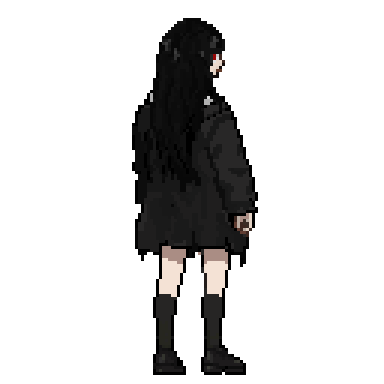
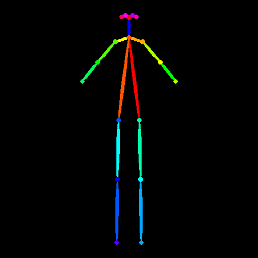
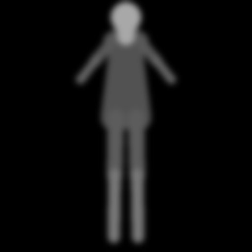
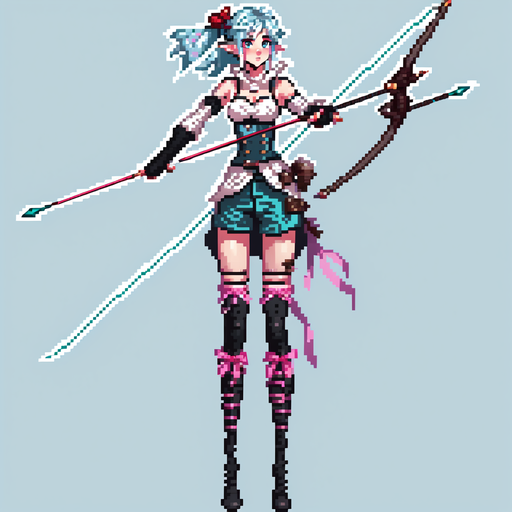

# 픽셀 스프라이트 파이프라인

캐릭터 일러스트 몇 장을 넣으면 같은 캐릭터를 앞, 옆, 뒤에서 본 게임용 도트 스프라이트를 만들어 줍니다.
전부 내 컴퓨터에서 돌아갑니다. API 키도, 장당 요금도, 업로드도 없습니다.

<p align="center">
  
  <br>
  <sub>AI로 생성한 뒤 직접 손본 결과물</sub>
</p>

## 어떻게 만드는가

일러스트를 그대로 축소하면 도트가 아니라 뭉개진 그림이 됩니다.
그래서 캐릭터를 뼈대와 부피로 먼저 세운 다음, 그 위에 그림을 그리게 합니다.

<table>
<tr>
<td align="center" width="33%">
  <br>
  <b>1. 뼈대</b><br>
  <sub>팔다리가 어디 있는지</sub>
</td>
<td align="center" width="33%">
  <br>
  <b>2. 부피</b><br>
  <sub>몸이 얼마나 두꺼운지, 어느 쪽이 앞인지</sub>
</td>
<td align="center" width="33%">
  <br>
  <b>3. 기준 그림</b><br>
  <sub>이 캐릭터가 누구인지 정하는 한 장</sub>
</td>
</tr>
</table>

뼈대는 사람 형태면 자동으로 잡히고, 손으로 고칠 수도 있습니다.
깊이 맵은 뼈대에서 계산하기 때문에 사람이 아닌 몸 (용, 거미, 뱀 같은) 도 됩니다.

<p align="center">
  
  <br>
  <sub>같은 포즈를 앞, 옆, 뒤, 반대쪽 옆에서 본 것. 방향은 각도 하나로 정합니다.</sub>
</p>

3번 그림이 정해지면 나머지 방향은 전부 그걸 기준으로 만듭니다.
씨드도, 프롬프트도, 기준 그림도 그대로 두고 뼈대만 바꾸기 때문에 방향이 달라져도 같은 캐릭터가 나옵니다.

마지막으로 8x8 블록 단위로 색을 정리해서 진짜 도트로 바꾸고, 팔레트를 고정합니다.
색을 고정하니까 프레임마다 색이 미묘하게 달라지는 일이 없습니다.

## 실행

```
make up                        # ComfyUI, Ollama, 웹 UI 켜기
make run CONFIG=char_1         # 캐릭터 한 명 만들기
make check                     # 설정 검사만, GPU 안 씀
```

브라우저에서 `127.0.0.1:8000`을 열면 위 과정을 눈으로 보면서 조정할 수 있습니다.
밤새 여러 캐릭터를 만들려면 큐에 넣고 자동으로 돌리면 됩니다.

## 문서

| 파일 | 내용 |
|---|---|
| [CONFIGURING.md](CONFIGURING.md) | 32x32, 64x64 같은 다른 크기로 바꾸는 법 |
| [STYLES.md](STYLES.md) | 스타일 시트. 한 번 정한 화풍을 캐릭터마다 재사용 |
| [DECISIONS.md](DECISIONS.md) | 기본값을 그렇게 정한 이유. 대부분 직접 재보고 정했습니다 |
| [OVERNIGHT.md](OVERNIGHT.md) | 다른 컴퓨터에서 밤새 돌리기 |
| [docs/PROJECT.md](docs/PROJECT.md) | 설치, 구조, 자세한 설명 |

Apple Silicon (M4, 16GB) 에서 만들고 재봤습니다.
SDXL과 픽셀아트 LoRA를 씁니다. 둘 다 오픈 웨이트라 각자 컴퓨터에서 돌릴 수 있습니다.
